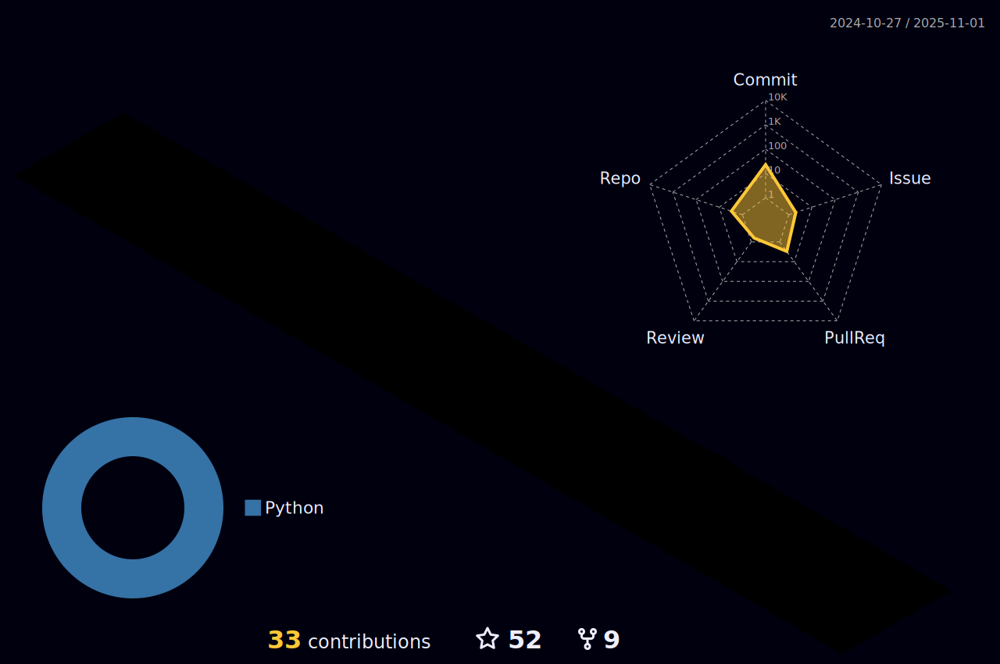

<div align="center">

<!-- HEADER SECTION -->


<!-- ANIMATED TYPING -->
[](https://git.io/typing-svg)

<!-- BADGES ROW -->
<p>
  
  
  
</p>

<!-- SOCIAL LINKS -->
<p>
  <a href="https://github.com/manm15"></a>
  <a href="https://spse.gq"></a>
</p>

<!-- DIVIDER -->


</div>

<!-- TROPHY SECTION -->
<details open>
<summary><h2>🏆 GitHub Trophies</h2></summary>
<div align="center">
  
</div>
</details>

<!-- ABOUT ME SECTION -->
<details open>
<summary><h2>🧑‍💻 About Me</h2></summary>


```yaml
name: Moses
location: Hong Kong 🇭🇰
role: Cybersecurity Developer & Full-Stack Engineer

currently_working_on: SPSE.gq
learning: Advanced Security Techniques

expertise:
  - Full-Stack Development
  - Backend Engineering
  - Frontend Development
  - Cybersecurity

fun_facts:
  - 🎮 Favourite Game: CS:GO
  - 🏸 Favourite Sport: Badminton
```

<br clear="right"/>

</details>

<!-- TECH STACK SECTION -->
<details open>
<summary><h2>🛠️ Tech Stack</h2></summary>

<div align="center">

### Languages


### Skills


</div>
</details>

<!-- PROJECTS SECTION -->
<details open>
<summary><h2>🚀 Featured Projects</h2></summary>

<div align="center">

| Project | Description | Status |
|:-------:|:-----------:|:------:|
| 🌠**SPSE.gq** | Main project |  |
| 🔱 **Neptune V** | Neptune project |  |
| ⚡ **Plasma Executor** | Execution tool |  |
| 🛡️ **PR0T0N** | Security tool |  |
| 🌠**ContWeb** | Web project |  |
| 📱 **SPSEmus** | Emulator project |  |
| 🛡️ **ByteX Antivirus** | Antivirus software |  |
| 📜 **OpenBAT** | Batch framework |  |

</div>

<div align="center">
  
</div>

</details>

<!-- GITHUB STATS SECTION -->
<details open>
<summary><h2>📊 GitHub Statistics</h2></summary>

<div align="center">


</div>

<!-- CONTRIBUTION SNAKE -->
<div align="center">
  <picture>
    <source media="(prefers-color-scheme: dark)" srcset="https://raw.githubusercontent.com/mosesman831/mosesman831/output/github-contribution-grid-snake-dark.svg">
    <source media="(prefers-color-scheme: light)" srcset="https://raw.githubusercontent.com/mosesman831/mosesman831/output/github-contribution-grid-snake.svg">
    
  </picture>
</div>

<!-- 3D CONTRIBUTION GRAPH -->
<div align="center">
  
</div>

</details>

<!-- ACTIVITY GRAPH -->
<details open>
<summary><h2>📈 Activity Graph</h2></summary>

<div align="center">
  
</div>
</details>

<!-- GAMING & HOBBIES -->
<details open>
<summary><h2>🎮 Gaming & Hobbies</h2></summary>

<div align="center">

### Gaming


### Sports


</div>
</details>

<!-- ADDITIONAL INFO -->
<details open>
<summary><h2>✨ Other Info</h2></summary>

<div align="center">


</div>
</details>

<!-- FOOTER -->
<div align="center">


### 💜 Thanks for visiting!


</div>
